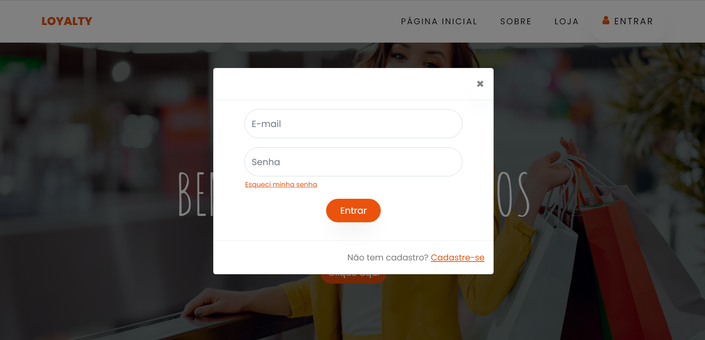
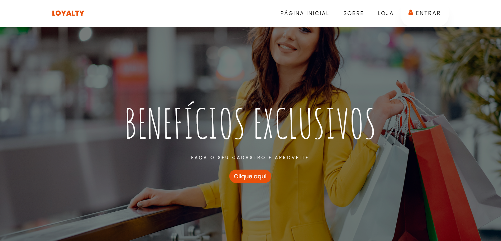
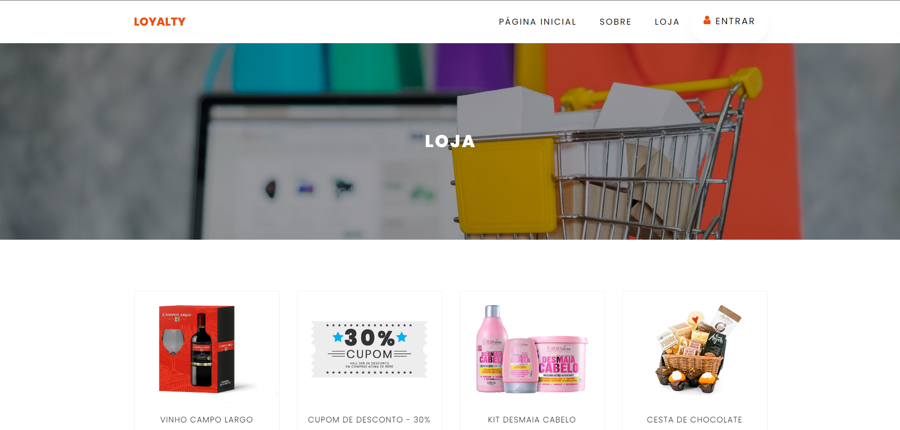

<h1 align="center">
  Projeto LOYALTY
 
</h1>

  <a href="#-tecnologias">Tecnologias</a>&nbsp;&nbsp;&nbsp;|&nbsp;&nbsp;&nbsp;
  <a href="#-projeto">Projeto</a>&nbsp;&nbsp;&nbsp;|&nbsp;&nbsp;&nbsp;
  <a href="#-deploy">Deploy</a>&nbsp;&nbsp;&nbsp;|&nbsp;&nbsp;&nbsp;
  <a href="#-autor">Autor</a>

 

 

  
  
  
  

## 🚀 Tecnologias

Esse projeto foi desenvolvido com as seguintes tecnologias:

- HTML
- CSS
- JS
- PHP
- MySQL

## 💻 Projeto

Este projeto consiste no aprimoramento de um programa de fidelidade, facilitando sua utilização e ampliando os tipos de recompensas nele oferecidas. O cliente possui a autonomia para cadastrar o código de sua compra e assim registrar os pontos ganhos na compra. Além disso, ele poderá trocar seus pontos acumulados por diversos benefícios disponíveis na loja virtual do programa. Será implementada, também, uma área de administrador na qual será possível realizar consultas sobre o histórico de pontos e trocas de todos clientes, assim como emitir relatórios.

Este projeto foi realizado em grupo, pelos seguintes integrantes:

- Ariel Xavier;
- Joyce Ribeiro;
- Daniel Silvano;

🔖 Deploy

Você pode visualizar a aplicação do projeto através [desse link](https://ariel.msi.dev.br/SLP/).

Obs: Esta aplicação pode ser utilizada em quaiquer aparelhos celular e/ou desktop

---

## 🦸 Autor

<a href="https://www.linkedin.com/in/ariel-xavier-2b1960190/">
 
  
 <b>Ariel Xavier</b></a>
  

 

---

Feito por Ariel Xavier [Entre em contato!](https://www.linkedin.com/in/ariel-xavier-2b1960190/)

---
